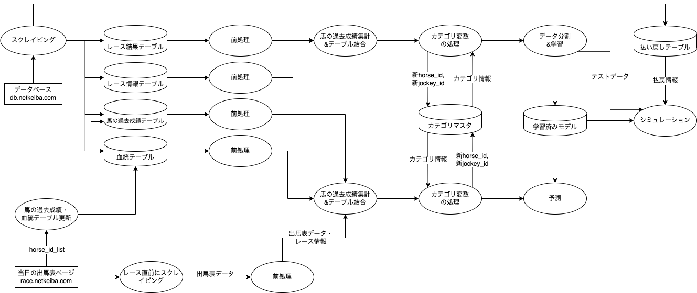
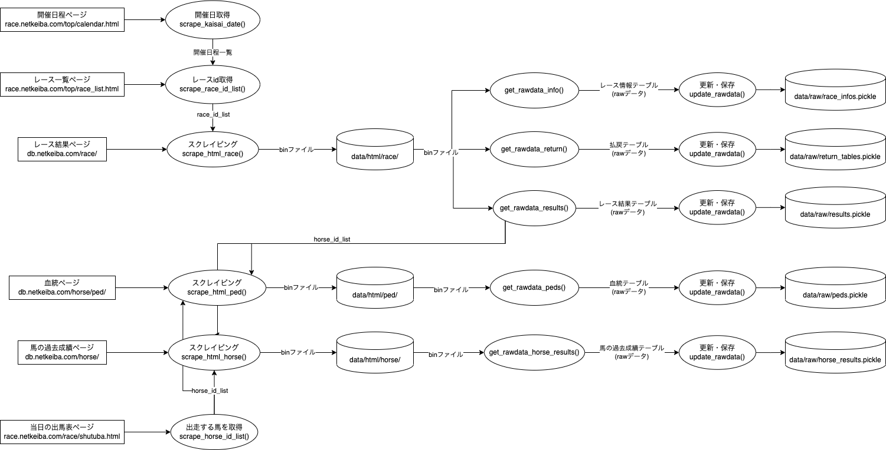

# keibaAI-v2
共同開発用のリポジトリ。修正点・追加機能などの要望やpull requestはこちらへ。  
実行するnotebookは、main.ipynb。ソースコードの解説、書籍への反映は順次行っていきます。

（注）ローカルで編集をしてPull requestを送る場合、このリポジトリへは直接pushできないので、forkしたリポジトリをcloneし、作業を行ってください。
forkしたリポジトリへpushすることで、その後、本リポジトリにPull requestを送ることができます。

# 環境
本リポジトリのコードは以下の環境で開発されました
- OS: MacOS 12.3.1
- IDE: Visual Studio Code 1.70.1
- 言語: Python 3.8.5

# 必要なライブラリをインストール
本リポジトリは以下のコマンドで必要なPythonライブラリをインストールします。
(wheelはlightbgmをインストールするために必要です。)
```
pip install wheel
pip install -r requirements.txt
```

# データフロー図
## 全体図


## preparing
スクレイピング部分の処理詳細


# ライセンス・免責事項
- レポジトリや書籍に掲載されているソースコードにつきまして、運営者の許諾なしにコンテンツの全部または一部を転載・再配布することはお控えください。
- ソースコードの加筆修正や、コミュニティ内における共有は可とします。
- ソースコード以外の共有（買い目や予測モデル構築ステップなど）につきましては、コミュニティ外部への共有であっても可とします。（その場合、書籍をご紹介いただけると幸いです。）
- 情報の正確さ、安全性の向上、不都合に対するサポートなどに対しては可能な限り力をいれておりますが、利用者が書籍やリポジトリを利用して生じた損害に関して、運営者は責任を負わないものとします。

# スクレイピング時の注意点
for文の中などで、複数ページに渡るスクレイピングを行う際は、**サーバーに負荷をかけないように1アクセスごとに必ず`time.sleep(1)`などで1秒間以上の待機時間を入れるようにしてください**。（[「健全なスクレイピング」だと判断](http://librahack.jp/wp-content/uploads/announcement-20110225.pdf)された[過去事例](http://librahack.jp/okazaki-library-case/stress-test-thinking.html)）
```python
for race_id in race_id_list:
    # 待機時間を入れる
    time.sleep(1)
    url = "https://db.netkeiba.com/race/" + race_id
    html = requests.get(url)
    # 以下省略
```

特に、自分でカスタマイズしてコードを書いている時などは、`time.sleep(1)`が抜けてしまわないようにスクレイピング前に確認をお願いします。（netkeiba.comはAkamaiというサービスを利用しており、悪質なスクレイパー扱いをされるとAkamaiを利用している他のサイトにも一時的にアクセスできなくなる場合があるようなので、注意しましょう。）